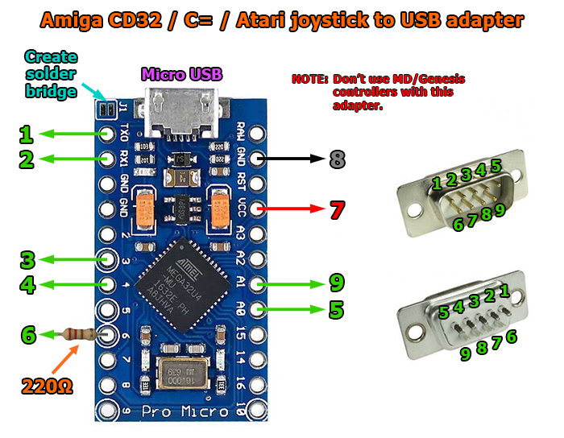

# DaemonBite-CD32-USB
## Introduction
With this simple to build  adapter you can connect Amiga CD32 gamepads and Commodore/Amiga/Atari joysticks to a PC, Raspberry PI, MiSTer FPGA etc. The Arduino Pro Micro has very low lag when configured as a USB gamepad and it is plug n' play once it has been programmed. 

## Parts you need
- Arduino Pro Micro (ATMega32U4)
- Male end of Mega Drive controller extension (or DSUB 9Pin Male connector and some wires)
- 220Ω resistor
- Heat shrink tube (Ø ~20mm)
- Micro USB cable

## Wiring

## License
This project is licensed under the GNU General Public License v3.0.
