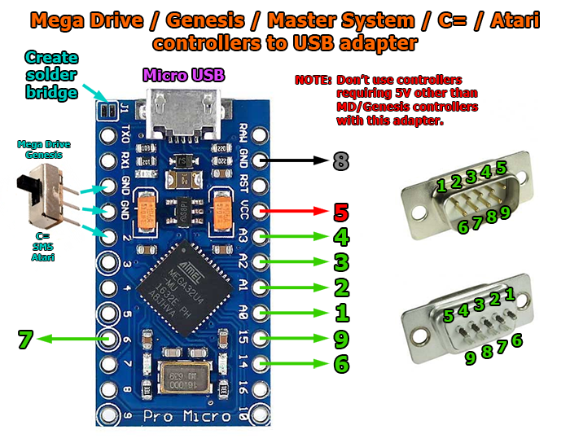
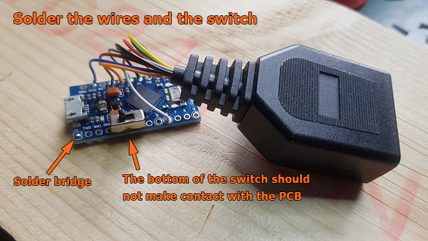
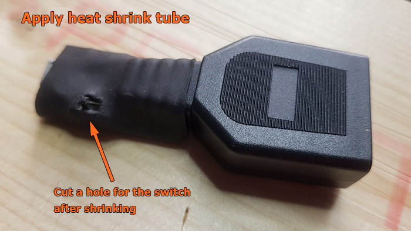

# DaemonBite Sega Controller To USB Adapter
## Introduction
This is a simple to build adapter for connecting Mega Drive (Genesis), Master System (+ Atari and C= controllers) to USB. It supports 3 and 6-button Mega Drive controllers and 1 and 2-button SMS/Atari/C= controllers. The Arduino Pro Micro has very low lag when configured as a  USB gamepad and it is plug n' play once it has been programmed. 

The Mega Drive gamepad interface is based on this repository : https://github.com/jonthysell/SegaController but almost entirely rewritten and a lot of optimisations have been made.

## Parts you need
- Arduino Pro Micro (ATMega32U4)
- Male end of Mega Drive controller extension (or DSUB 9Pin Male connector and some wires)
- SPDT Switch (2.54mm/0.1" pitch)
- Heat shrink tube (Ø ~20mm)
- Micro USB cable

## Wiring

## How to assemble

  
(The switch goes to pins GND-GND-2 even if the picture above shows it connected to GND-2-3)

## The Switch
When the switch is in the position closer to the USB port of the Arduino Pro Micro, the adapter will be in SMS/Atari mode. When it is in the other position, it will be in Mega Drive/Genesis mode.

## License
This project is licensed under the GNU General Public License v3.0.
