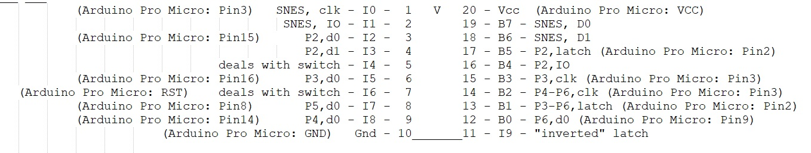
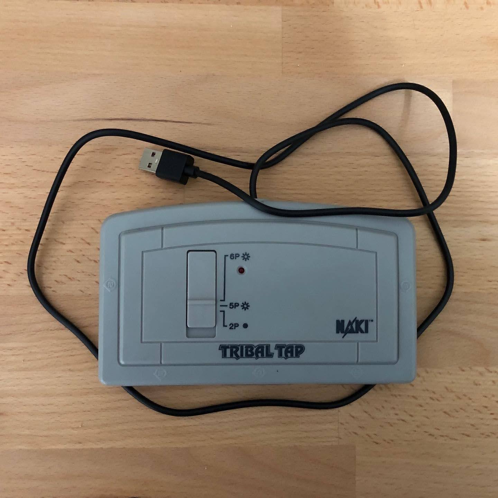
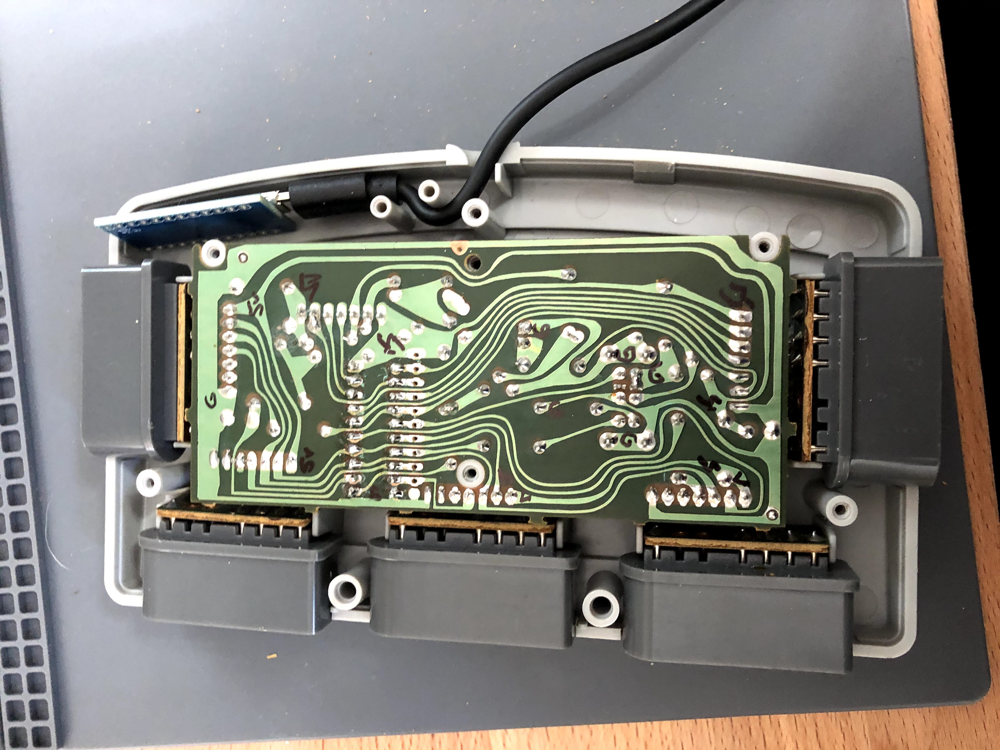
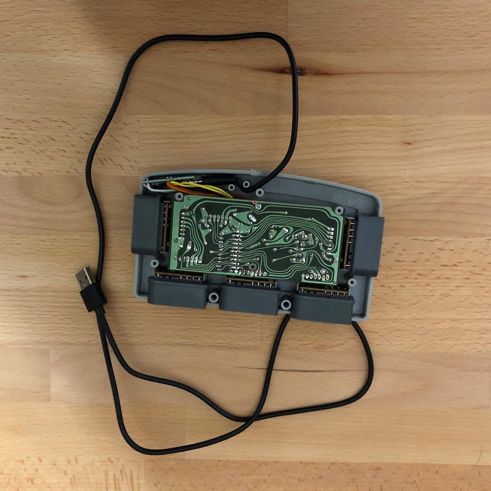

# 5x DaemonBite SNES/NES USB Controller adapter  
## (modified version that supports 5 SNES controllers)

## Introduction
Based on the excellent work in the original project found here: https://github.com/MickGyver/DaemonBite-Retro-Controllers-USB this version will support 5 SNES gamepads at the same time.

This is using a workaround for this issue:
https://github.com/MickGyver/DaemonBite-Retro-Controllers-USB/issues/3

"The CDC Serial uses 3 endpoints. This means you can add up to 3 devices for the 32u4 and 1 for the 8/16/32u2. If you add more, some will be ignored."
https://github.com/NicoHood/HID/issues/205

I found a fix, that others have used when creating usb keyboards. It disables the CDC to free up resources. https://github.com/gdsports/usb-metamorph/tree/master/USBSerPassThruLine

## Original text and parts information:
With this simple to build  adapter you can connect NES gamepads to a PC, Raspberry PI, MiSTer FPGA etc. The Arduino Pro Micro has very low lag when configured as a USB gamepad and it is plug n' play once it has been programmed. 

## Parts
- Arduino Pro Micro (ATMega32U4)
- Male end of NES controller extension cable
- Heat shrink tube (Ø ~20mm)
- Micro USB cable

## Updated 5-port Wiring

## Example using tribal tap 5 port tap
 -In my case, I built this into an old tribal tap device.  I removed the IC (which never actually supported all 5 ports) and wired the arduino into the existing PCB in place of the right pins.  The board fits right in, and usb routes out the back of the device in place of the original connector.
 
 
							

## License
This project is licensed under the GNU General Public License v3.0.
