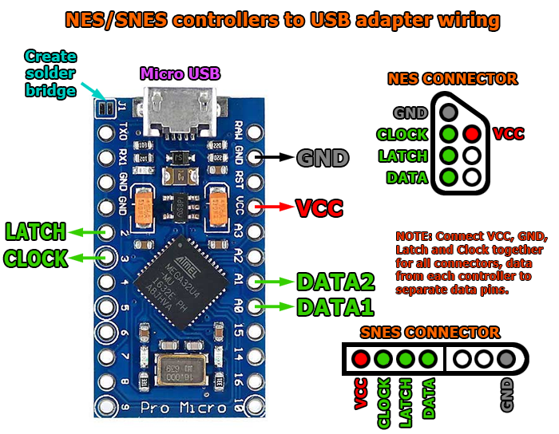

# DaemonBite SNES/NES USB Controller adapter with NTT Datapad support
## Introduction
With this simple to build  adapter you can connect SNES and NES gamepads to a PC, Raspberry PI, MiSTer FPGA etc. The Arduino Pro Micro has very low lag when configured as a USB gamepad and it is plug n' play once it has been programmed. The controller type is auto-detected.

The NTT Data Keypad controller for SNES is also supported in this version. For a faster version, use the project in the SNESControllersUSB folder.

## Parts you need
- Arduino Pro Micro (ATMega32U4)
- Male end of SNES or NES controller extension cable
- Heat shrink tube (Ø ~20mm)
- Micro USB cable

## Wiring

## License
This project is licensed under the GNU General Public License v3.0.
