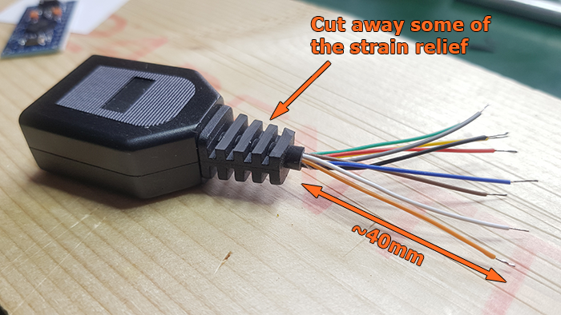
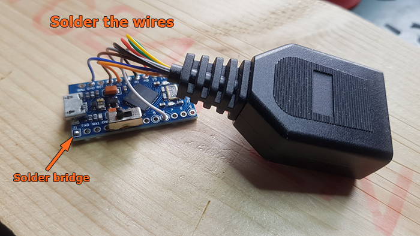
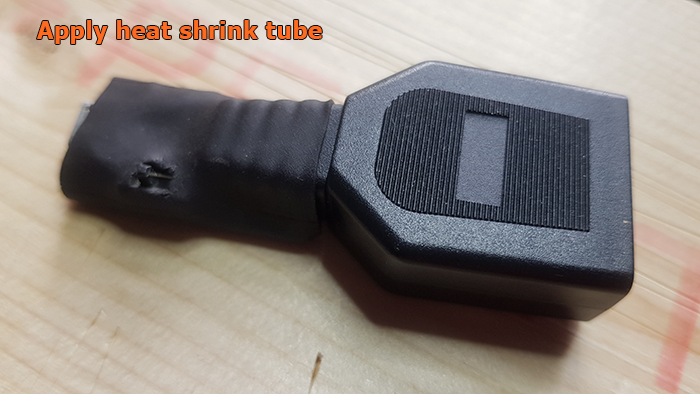

# DaemonBite Sega Controller To USB Adapter
## Introduction
This is a simple to build adapter for connecting Mega Drive (Genesis), Master System (+ Atari and C= controllers) to USB. It supports 3 and 6-button Mega Drive controllers and 1 and 2-button SMS/Atari/C= controllers.

The input lag for this adapter is minimal. Here is the result from a test with a 1ms polling rate on a MiSTer:

| Controller | Samples | Average | Max | Min | Std Dev |
| ------ | ------ | ------ | ------ | ------ | ------ | 
| Original 3-Button Mega Drive Controller | 2342 | 0.75ms | 1.28ms | 0.24ms | 0.29ms |
| 8bitdo M30 Wireless 2.4G | 2348 | 4.54ms | 8.05ms | 2.22ms | 1.31ms |

## Parts you need
- Arduino Pro Micro (ATMega32U4)
- Male end of Mega Drive controller extension (or DSUB 9Pin Male connector and some wires)
- Heat shrink tube (Ø ~20mm)
- Micro USB cable

## Wiring

## How to assemble (please ignore the switch)

  
(The switch goes to pins GND-GND-2 even if the picture above shows it connected to GND-2-3)

## License
This project is licensed under the GNU General Public License v3.0.

## Credits
The Mega Drive gamepad interface is based on this repository : https://github.com/jonthysell/SegaController but almost entirely rewritten and a lot of optimisations have been made.
